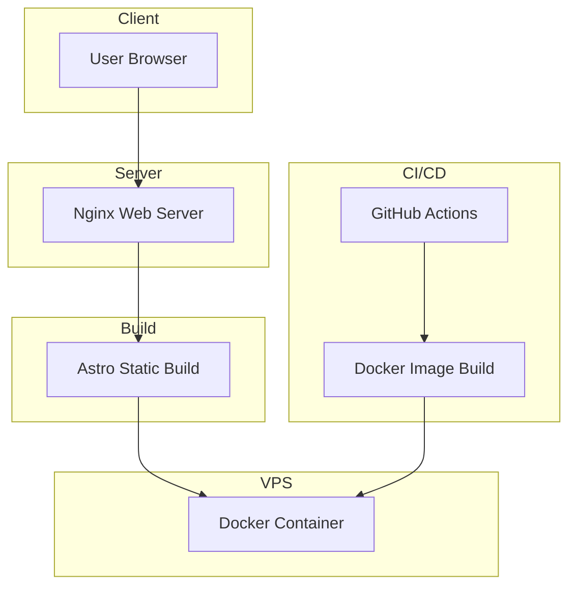

# DayB Portfolio


Portfolio personal con una UI inspirada en JetBrains / IntelliJ, construido con Astro y Tailwind CSS.

El sitio es completamente estático (SSG), bilingüe y orientado a backend, optimizado para rendimiento, simplicidad operativa y despliegue automatizado.

🌐 **Live site:** https://davidruiz.es  
📦 **Repository:** https://github.com/DayBRR/dayb-portfolio

## Características

- UI tipo IDE con header, explorer lateral y área principal estilo editor.
- ES/EN real con `?lang=en`, cookie, `localStorage` y switch visible.
- Tema claro/oscuro persistente.
- Contenido tipado en TypeScript desde `src/data/portfolio.ts`.
- Modal de proyectos con `<dialog>` nativo y datos por proyecto.
- Metadatos SEO base, canonical y Open Graph desde `MainLayout.astro`.
- Diagrama de arquitectura configurable en `src/data/diagrams/dayb-portfolio-architecture.json`.
- Build estático con Astro, releases automatizadas con release-please y despliegue continuo con GitHub Actions + Docker.

## Stack

### Frontend

- Astro 5
- Tailwind CSS
- TypeScript

### Infrastructure

- Docker
- Nginx
- GitHub Actions
- release-please

## Desarrollo local

### Requisitos

- Node.js 20+
- npm

```bash
npm install
npm run dev
```

Servidor local por defecto: `http://localhost:4321`

## Build y preview

```bash
npm run build
npm run preview
```

La salida estática se genera en `dist/`.

## Architecture

El portfolio sigue una arquitectura estática optimizada para simplicidad y rendimiento.

Browser → Nginx → Static Files (Astro build)

Principios principales:

- Static Site Generation con Astro
- JavaScript mínimo en cliente
- Deploy dockerizado
- Runner self-hosted para GitHub Actions
- Releases automatizadas con release-please

El siguiente diagrama resume el flujo de build, deploy y runtime del portfolio.



## Releases y deploy

El flujo de integración y despliegue continuo es el siguiente:

1. Push a `main`.
2. GitHub Actions ejecuta `.github/workflows/release-please.yml` para preparar o actualizar la release con `release-please`.
3. GitHub Actions ejecuta `.github/workflows/deploy.yml` en un runner self-hosted.
4. El workflow construye la imagen Docker del portfolio.
5. En el VPS, `docker compose up -d` actualiza el contenedor.
6. Nginx sirve el contenido generado por Astro desde `dist/`.

El `Dockerfile` usa una build multi-stage:

- Stage 1: `node:20-alpine` para ejecutar `npm install` y `npm run build`.
- Stage 2: `nginx:alpine` para servir `dist/` en producción.

## 📝 Commit Convention

This project follows **Conventional Commits** to maintain a clear and structured commit history and to enable automated releases.

Commit messages follow this format:

`<type>(optional scope): description`

Examples:

```text
feat(portfolio): add project filtering
fix(ui): improve card spacing on mobile
docs(readme): update project documentation
refactor(components): simplify project card logic
chore(ci): update GitHub Actions workflow
```

### Common Commit Types

| Type     | Description                                |
| -------- | ------------------------------------------ |
| feat     | Introduces a new feature                   |
| fix      | Fixes a bug                                |
| docs     | Documentation changes                      |
| refactor | Code refactoring without changing behavior |
| chore    | Maintenance tasks                          |
| ci       | Continuous integration changes             |

Releases and changelogs are automatically generated using **release-please** based on these commit messages.

## Notas

- Si `repo` o `demo` están vacíos, los botones del modal se ocultan.
- Los estados de proyecto se definen en `src/data/projectStatus.ts`.
- `astro.config.mjs` intenta cargar `@astrojs/sitemap` solo si la dependencia está instalada.

## Contributions

Las contribuciones no son necesarias para este proyecto, pero cualquier sugerencia o mejora es bienvenida mediante issues o pull requests.

## License

MIT

---
Built by **David Ruiz**

Backend Engineer focused on reliable systems, automation and clean architecture.